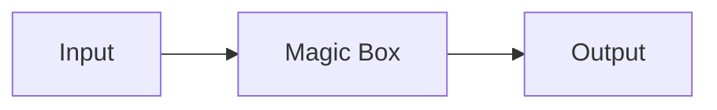
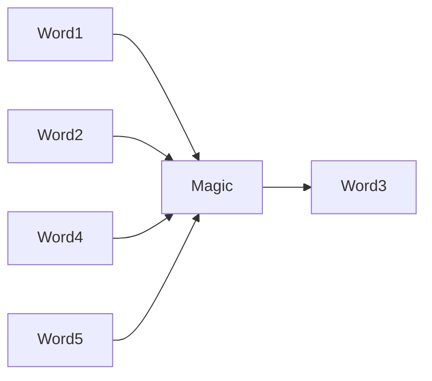
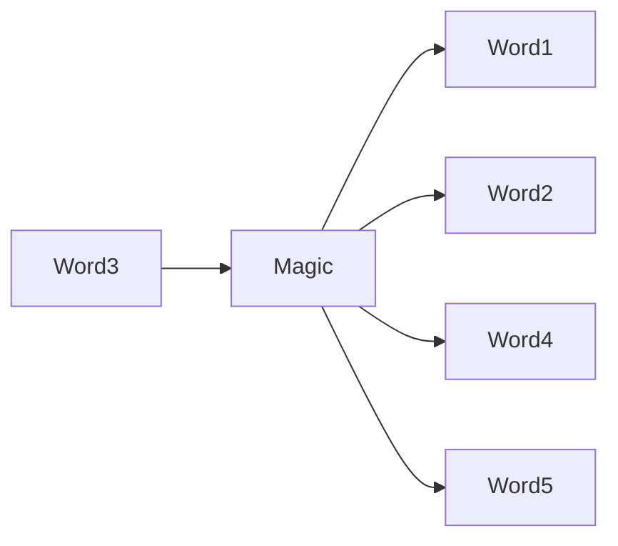
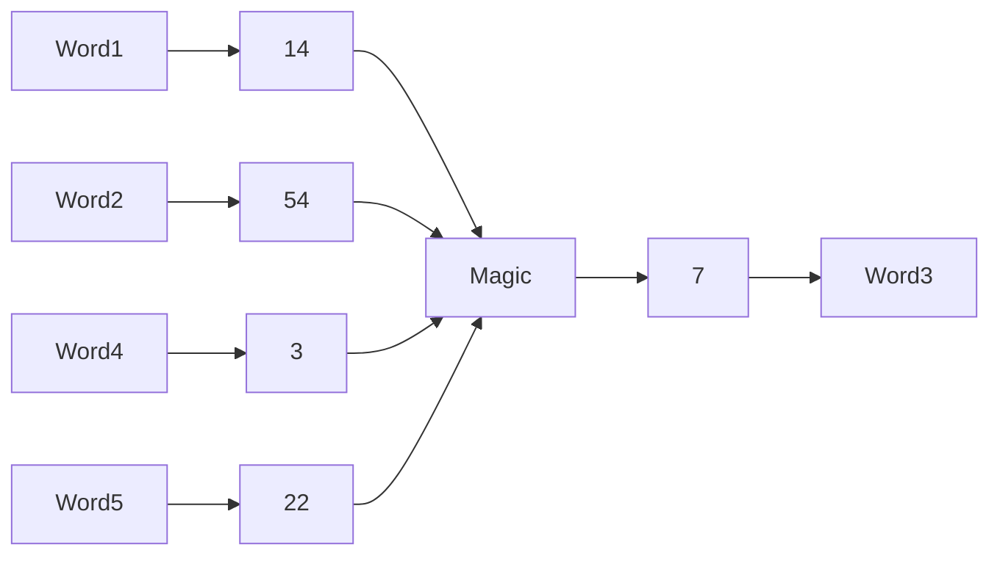
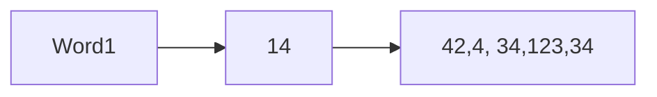
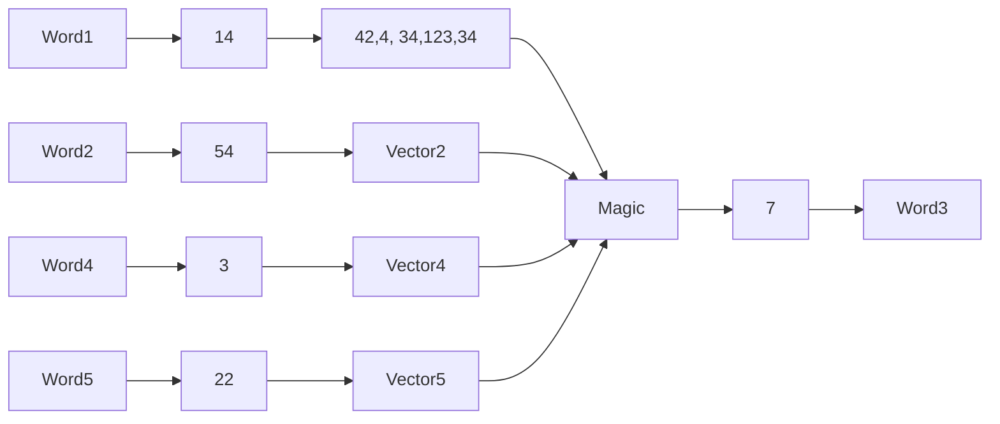
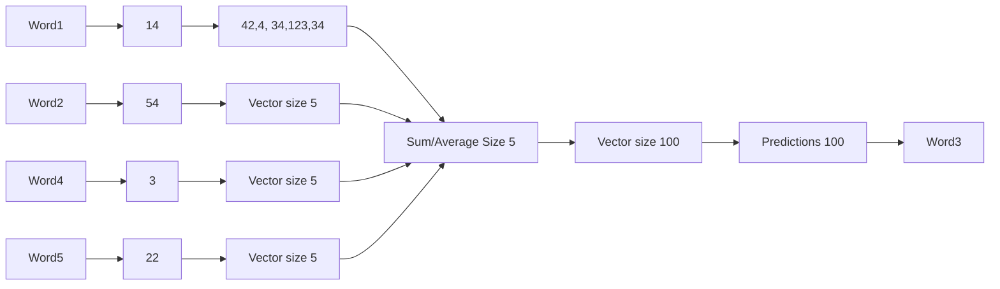

1. Machine learning is at the center of the world currently, especially LLMs based on transformers. But what exactly are transformers? You may or may not already have an indepth knowledge of what happens inside the black box. 

2. I recommend a video by 3Blue1Brown, which I think does a great job at explaining the internal mechanics behind transformers.

3. I want to offer yet another perspective on the topic, one that I find more intuitive. I will try to avoid using non-mathematical concepts to derive the same results. However, I will likely use the non-mathematical concepts to explain the intuition behind the topic.

4. Background in maths, machine learning and related fields will help you follow along and understand. However, I hope to make this video intuitive enough for anyone to be able to follow.

5. I would like to cover the intuitive logic that goes behind transformers, covering a possible way one can derive and arrive to the same conclusion as KV matix multiplicatoins in transformers.

6. I will first cover word2vec, moving on to BERT and then to transformers.

I would like to preface everything with a mention of a few important things:
- We have the advantage of hindsight when deriving things, and thus all the suggestions I make will feel very convenient.
- Computers, and especially GPUs are very fast at doing linear algebra. Specifically we work with tensors. A tensor is a generalisation of vectors, matrices, single values, 4-dimensional arrays, etc.

# Flow of data, functions, etc.
First, lets try to visualise what can happen to embeddings. I think we can start by treating an LLM as a black box at first, and progressively try to uncover every single bit, by looking into fundamentals.

# Word2Vec
Lets consider the previous diagram, but in the context of a word2vec model.

Word2vec gave us a way to represent words as vectors. Trained on a large enough body of text (known as a corpus), it gives us vectors that "capture meaning of words". 

Now, what does it mean for a word to have a meaning? Or what does it mean for it to be captured. I'd like to avoid having a metaphysical discussion, and instead we can try to put boundaries on what we mean by "meaning".

In word2vec's case, there is a sliding window of a fixed size travelling across the corpus. For each collection of words, we can do one of the two things: 

1. Given a word in the conter of the window, predict neighbouring words. AKA "Continious Bag of Words or CBOW"

2. Given all the words in the window, predict the word in the center. aka "Skip-Gram"

Pssst, here is a secret: you can see it as the same thing - try predicting e word based on its neighbours. But let's first focus on the first case.

Let's investigate further how CBOW internally works:

As you probably know, NN's work with numbers. We cannot really do meaningful maths with words as they are - we need to somehow figure out how to represent them as numbers.

Let's say we have a vocabulary of 10,000 words. We can then assign a number to each word.
We can literally use a lookup table, like 5 means "apple", 14 means "banana", etc.

Sure, we can use numbers for each word, but what does it mean for a word to be close to another?
Does a word number 14 have anything to do with a word number 13?
Or is it twice the word number 7?
Is the word number 1 the best? Or is it the strongest? Or what?

We probably want to have a more sophisticated way of representing words. How about instaed of picking a single number, we use a bunch of numbers as a group to represent a word, i.e. a vector.

Now, we can say that the word "apple" is close to "banana" if the vector for "apple" is close to the vector for "banana".

Now, with vectors we can do some cool stuff. For example, we can use an arbitrary number of different values to represent a word. Whilst, at the same time, we can still compare words to each other. The above is true provided that our vectors are of the same size.

Another cool thing is that vectors are still tensors, and we can use matrix multiplication to transform them.

So what does magic do here? Remember, we basically only have algebra operations to work with. 
In w2v specifically, we take an average of them, and then multiply it by a matrix.
Let's say that our vectors are of a fixed size 5, and our total vocabulary is 100.

The goal of the magic box is to take a vector of size 5, and provide an output that gives us a some prediction on what the new word is supposed to be. If we multiply a vector of size 5 by a matrix of size 5x100, we get a vector of size 100.

We can then decide that the goal of the new vector to have a higher value at index i if the word i is more likely to be the next word.

We can then apply a softmax function to the vector to convert values from arbitrary range to a range between 0 and 1.

AAA